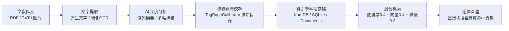
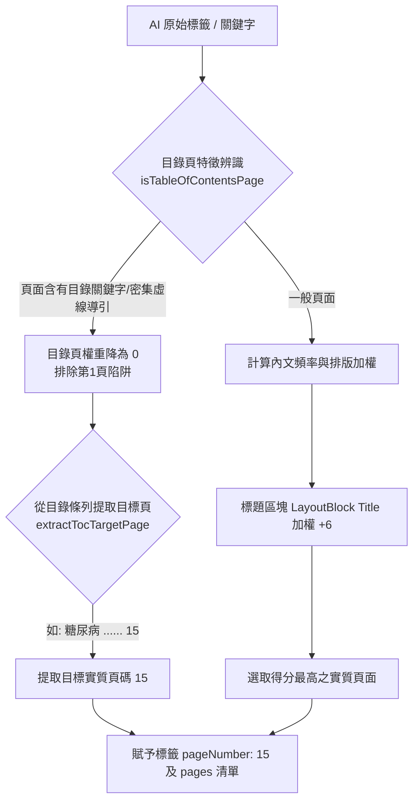
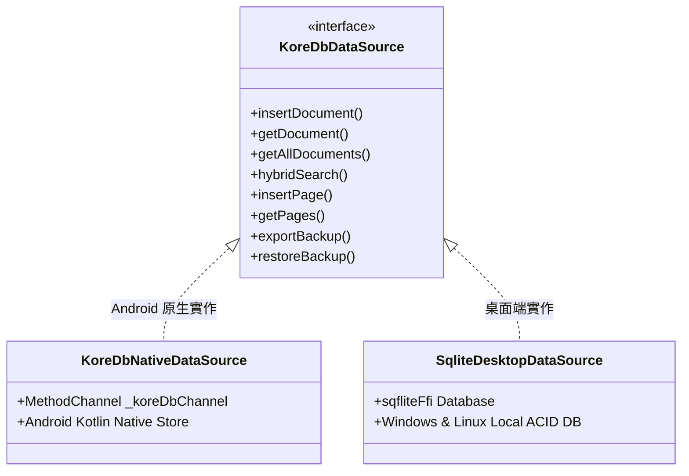

# 個人智能文獻檢索系統 (Smart Document Search) 使用說明書
**版本：v0.1.6**  
**適用平台：Android (手機/平板) & Windows 11 / Linux (桌面端)**

> **v0.1.6 更新重點**
> 1. **進階關鍵字運算子**：新增 `+`（必須全部包含，AND）與 `-`（排除，NOT）語法，檢索體驗對齊主流搜尋引擎。
> 2. **大量文獻檢索效能優化**：導入常駐全文索引快取 (`doc_index`)、以子字串掃描取代正規表達式、並將頁碼與引註計算延後至實際呈現的結果，顯著降低大量文獻下的檢索延遲。
> 3. **API 金鑰跨平台加密儲存修正**：改採獨立加密金鑰檔 (`api_keys.json`) 並升級為 HMAC-SHA256 串流加密，徹底解決 Windows 環境下 API 金鑰無法保存、每次需重新輸入的問題。
> 4. **介面美化與配色主題**：全新 Material 3 視覺（圓角卡片、統一框線與字級），並提供 7 種配色主題，可與深色模式自由組合。
> 5. **Windows 穩定性與資料庫相容性**：資料庫升級至 Schema v3，啟用 WAL 與 busy_timeout，並強化還原交易與快取一致性。

---

## 目錄
- [系統概述與特色架構](#系統概述與特色架構)
- [單元一：文獻匯入、智能摘要與標籤註計方式](#單元一文獻匯入智能摘要與標籤註計方式)
  - [1.1 支援文獻格式與檔案匯入流程](#11-支援文獻格式與檔案匯入流程)
  - [1.2 文字提取機制：原生文字直接判讀 vs 端側 OCR](#12-文字提取機制原生文字直接判讀-vs-端側-ocr)
  - [1.3 AI 智能條列式摘要產生機制](#13-ai-智能條列式摘要產生機制)
  - [1.4 結構化多維度標籤辨識機制](#14-結構化多維度標籤辨識機制)
  - [1.5 標籤實質頁碼校準演算法（防止目錄頁誤導）](#15-標籤實質頁碼校準演算法防止目錄頁誤導)
  - [1.6 標籤手動維護、審核狀態切換與重新分析](#16-標籤手動維護審核狀態切換與重新分析)
- [單元二：資料存放位置與全文資料庫存放方式](#單元二資料存放位置與全文資料庫存放方式)
  - [2.1 原始文獻實體檔案存放結構與安全副本](#21-原始文獻實體檔案存放結構與安全副本)
  - [2.2 自訂文獻儲存目錄設定指引](#22-自訂文獻儲存目錄設定指引)
  - [2.3 雙核心本地資料庫架構：Android KoreDB 與 Desktop SQLite](#23-雙核心本地資料庫架構android-koredb-與-desktop-sqlite)
  - [2.4 全文資料庫資料表綱要 (Schema)](#24-全文資料庫資料表綱要-schema)
  - [2.5 反向倒排索引與語義向量嵌入存儲](#25-反向倒排索引與語義向量嵌入存儲)
  - [2.6 全庫備份導出、GZip 壓縮與安全還原機制](#26-全庫備份導出gzip-壓縮與安全還原機制)
- [單元三：標籤搜尋、文字直接搜尋與多重關鍵字搭配指南](#單元三標籤搜尋文字直接搜尋與多重關鍵字搭配指南)
  - [3.1 混合檢索 (Hybrid Search) 核心權重模型](#31-混合檢索-hybrid-search-核心權重模型)
  - [3.2 標籤搜尋使用方式 (AND / OR 模式切換)](#32-標籤搜尋使用方式-and--or-模式切換)
  - [3.3 文字直接搜尋使用方式與引註高亮](#33-文字直接搜尋使用方式與引註高亮)
  - [3.4 多重關鍵字搭配技巧與飽和度計分規則](#34-多重關鍵字搭配技巧與飽和度計分規則)
    - [3.4.4 進階布林運算子：+ 必須包含／- 排除（v0.1.6 新增）](#344-進階布林運算子-必須包含-排除v016-新增)
  - [3.5 檢索結果直達：點擊跳轉實質頁面](#35-檢索結果直達點擊跳轉實質頁面)
  - [3.6 文獻內全文檢索與即時標記 (In-Document Search)](#36-文獻內全文檢索與即時標記-in-document-search)
- [單元四：系統環境設定與 AI 推理引擎配置](#單元四系統環境設定與-ai-推理引擎配置)
  - [4.1 支援的 AI 推理引擎 (地端 Ollama 與主流雲端 API)](#41-支援的-ai-推理引擎-地端-ollama-與主流雲端-api)
  - [4.2 疾病分類深度模式 vs 一般文獻模式](#42-疾病分類深度模式-vs-一般文獻模式)
  - [4.3 自適應雙欄介面 (Master-Detail Layout)](#43-自適應雙欄介面-master-detail-layout)
  - [4.4 介面外觀、配色主題與深色模式（v0.1.6 新增）](#44-介面外觀配色主題與深色模式v016-新增)
- [附錄：常見問題與故障排除 (FAQ)](#附錄常見問題與故障排除-faq)

---

## 系統概述與特色架構

**個人智能文獻檢索系統 (Smart Document Search)** 專為需要深度研讀、快速查閱大量專業文獻（如醫學研究論文、臨床指引手冊、疾病編碼指引、技術報告等）之專業人士設計。系統具備以下四大核心特性：



1. **離線優先與端側隱私保障**：檢索引擎完全在端側運行（BM25、倒排索引、向量比對、SQLite / KoreDB），無網路環境亦可完整離線秒級搜尋。
2. **全文深度條列摘要與精確頁碼回溯**：AI 分析全篇全文所有章節與段落，產生結構化條列重點，並標註來源頁碼 `(P.X)`。
3. **智慧標籤頁碼校準（防目錄頁誤導）**：具備目錄頁檢測、虛線導引解析與內文標題加權機制，確保標籤標註之頁碼精確指向內文展開討論的真實頁數，杜絕傳統檢索全落入第 1 頁目錄的問題。
4. **檢索結果定位直達**：檢索結果卡片點擊即可直達第一分頁「文獻內容」所屬實質命中頁面，大幅省去手動翻頁查找的寶貴時間。

---

## 單元一：文獻匯入、智能摘要與標籤註計方式

### 1.1 支援文獻格式與檔案匯入流程

系統支援批次與單一檔案匯入，支援的副檔名包含：
* **PDF 文獻**：`.pdf`
* **純文字與標記文件**：`.txt`, `.md`, `.markdown`, `.csv`, `.json`, `.xml`
* **圖片掃描檔**：`.png`, `.jpg`, `.jpeg`, `.webp`, `.bmp`
* **簡報檔**：`.ppt`, `.pptx`（系統會提示轉為 PDF 獲取最佳排版）

#### 匯入步驟：
1. **進入匯入功能**：在首頁儀表板點擊「**匯入新文獻**」卡片，或點擊文獻分頁右上角的匯入按鈕。
2. **選取檔案**：支援單選或多選多份文獻進行批次匯入。
3. **查重防護 (SHA-256)**：系統首先計算檔案的 SHA-256 數位指紋，若該檔案已存在於資料庫中，將主動提示「檔案已存在，略過重複匯入」，防止重複佔用空間。
4. **即時進度監控**：畫面呈現八階段進度指示器（雜湊計算 ➔ 頁面渲染 ➔ 原生/OCR 文字提取 ➔ AI 全文分析 ➔ 標籤頁碼校準 ➔ 向量嵌入生成 ➔ 本地資料庫儲存 ➔ 匯入完成）。

---

### 1.2 文字提取機制：原生文字直接判讀 vs 端側 OCR

系統秉持「**原生文字優先、無文字層則自動備援 OCR**」原則，兼顧極速效能與掃描檔相容性：

| 文獻類型 | 處理機制 | 說明 |
| :--- | :--- | :--- |
| **具原生文字層之 PDF** | **Syncfusion Direct Extractor** | 直接從 PDF 內部字元串流中提取文字，100% 精準保留原文字符，完全跳過耗能的 OCR 辨識，每頁處理耗時僅需數毫秒。 |
| **無文字層之掃描版 PDF** | **端側高解析 OCR 備援** | 透過原生 `PdfRenderer` 將版面渲染為清晰預覽圖像，並啟用端側高精確度 OCR 提取文字內容。 |
| **純文字 / Markdown / CSV** | **Native Stream Chunking** | 完整讀取 UTF-8 / 本地編碼字符，以每 1800 字為單位自動切分為邏輯分頁（Logical Pages），並分析其標題結構區塊。 |
| **單張圖片 / 拍照掃描** | **Native OCR Pipeline** | 對圖片直接執行光學字元辨識，產出文字圖層與邊界框（Bounding Box）。 |

---

### 1.3 AI 智能條列式摘要產生機制

文獻解析完成後，系統會將**「文獻標題 + 完整全文內容（最高支援 35,000 字元長上下文）」**打包傳遞給配置的 AI 推理引擎（Ollama、DeepSeek、GPT、Claude 或 Gemini）：

#### 1. 條列式核心結構 (Bullet-point Structure)
AI 摘要嚴格採用條列式呈現，並依據文獻類型自動適應結構：
* **學術論文類**：
  * `• 【研究背景與目的】(P.X) ...`
  * `• 【研究方法與對象】(P.X) ...`
  * `• 【主要發現與臨床數據】(P.X) ...`
  * `• 【結論與臨床意涵】(P.X) ...`
* **指引手冊 / 疾病分類報告 (Coding Clinic) 類**：
  * `• 【發布背景與規範目的】(P.X) ...`
  * `• 【案例解析與核心規則】(P.X) ...`
  * `• 【疾病分類與編碼指導】(P.X) ...`
  * `• 【臨床注意事項與併發症考量】(P.X) ...`
* **簡報 / 投影片類**：
  * `• 【簡報核心主旨】(P.X) ...`
  * `• 【各主題要點與關鍵洞察】(P.X) ...`
  * `• 【行動指引與總結】(P.X) ...`

#### 2. 強制性來源頁碼標註 `(P.X)`
AI 產生的每一條條列摘要項目均要求附帶原文來源頁碼（如 `(P.1)`、`(P.15)`）。在文獻詳情頁中，系統會將這些標註渲染為可點擊的藍色/琥珀色按鈕，點擊即可一鍵切換至該頁原文檢視。

#### 3. 英文文獻繁體中文雙語摘要對照
若文獻語言判斷為英文或外文，AI 除了保留原始語言摘要外，還會額外產製詳盡的「**英文文獻中文摘要說明 (`chinese_summary`)**」，並同樣保持附帶來源頁碼之條列格式，降低外語文獻研讀門檻。

---

### 1.4 結構化多維度標籤辨識機制

AI 在掃描全篇全文時，會從多個專業維度抽取結構化標籤，並賦予置信度評分：

```text
[疾病分類編碼] ────── E11.9 (ICD-10-CM) • 置信度 95% • P.15
[疾病/症狀]     ────── 第2型糖尿病 • 置信度 98% • P.15
[醫學術語]     ────── 糖化血色素 (HbA1c) • 置信度 92% • P.16
[主題]         ────── 降血糖藥物臨床指引 • 置信度 90% • P.3
[方法]         ────── 雙盲隨機對照試驗 (RCT) • 置信度 88% • P.4
```

1. **專業維度劃分**：
   * **疾病分類編碼**：ICD-10-CM 診斷碼、ICD-10-PCS 處置碼、ICD-11、SNOMED-CT，且標籤物件中完整紀錄 `code_system` 欄位。
   * **疾病/症狀**：臨床診斷名詞、徵候、病灶、併發症。
   * **醫學術語**：解剖生理名詞、檢驗項目、藥物學名、醫療技術。
   * **其他維度**：主題、領域、方法、對象、結論、文檔類型、年份、機構。
2. **置信度與代碼系統標記**：
   * 每個標籤紀錄 0.0 ~ 1.0 的置信度（如 `95%`）。
   * 標籤晶片外觀以紫色徽章標示所屬系統（如 `ICD-10-CM`）。

---

### 1.5 標籤實質頁碼校準演算法（防止目錄頁誤導）

#### 問題根因：
過去文獻檢索系統常因第一頁是「目錄頁（Table of Contents）」，目錄中羅列了所有章節關鍵字（如 `第三章 第2型糖尿病 ...... 15`），導致全文檢索或 AI 快速判斷時，將所有標籤之所屬頁數全部認定在「第 1 頁」，使用者點擊跳轉時永遠只看到目錄。

#### 解決方案：`TagPageCalibrator` 智慧校準器
本專案引進專利級的四道過濾與校準工序：



1. **目錄頁特徵辨識 (`isTableOfContentsPage`)**：
   * 自動辨識關鍵字：`目錄`、`Table of Contents`、`Contents`、`Index`、`目次`。
   * 偵測章節引導點線（如 `...... 15`、`…… 24` 等長引線特徵）。
   * 統計條列行密度與純數字頁碼聚集度。
2. **目錄目標頁反查 (`extractTocTargetPage`)**：
   * 若標籤出現在目錄頁，自動向後正則解析出該目錄項目所指向的實質頁碼（例如從「第三章 第2型糖尿病之治療指引 ...... 15」直接反查出第 15 頁）。
3. **內文頻率與版面標題加權掃描 (`findSubstantivePageForKeyword`)**：
   * 目錄頁的文字出現權重直接歸零。
   * 掃描全書所有頁面，普通內文段落出現計 +1 分；版面分析為「標題（Title/Header）」區塊計 +6 高分。
4. **實質頁碼寫入標籤**：
   * 將校準後的真實頁碼存入 `TagItem.pageNumber` 與 `TagItem.pages`，供後續檢索與介面直接調用。

---

### 1.6 標籤手動維護、審核狀態切換與重新分析

在「文獻詳情」頁面的第二分頁「**摘要與標籤**」中，使用者擁有最高資料自主權：

* **標籤審核狀態切換**：
  * 點擊標籤晶片本體即可切換「已審核 (藍色打勾圖示)」與「待審核 (橘色問號圖示)」。
  * 審核切換時，畫面下方會彈出 SnackBar 提示，並附帶「**前往第 X 頁**」的捷徑按鈕。
* **點擊實質頁碼直達內文**：
  * 每個標籤晶片內均嵌有藍綠色 `P.X` 徽章（如 `P.15`）。
  * 點擊該 `P.X` 徽章，系統會立即切換至第一分頁「文獻內容」並自動平滑滾動定位至第 15 頁。
* **手動新增結構化標籤**：
  * 點擊標籤卡片右上角的「+」按鈕。
  * 輸入標籤名稱、選擇所屬維度，並可自訂「**關聯文獻頁碼**」（預設為當前正在閱讀的頁數）。
* **刪除標籤**：點擊標籤右側的「✕」按鈕即可移除。
* **重新 AI 分析**：
  * 點擊摘要卡片下方的「**重新 AI 生成摘要與標籤**」按鈕，系統會重新讀取全篇全文，再次呼叫當前配置之 AI 引擎進行深度重新分析並自動執行標籤頁碼校準。

---

## 單元二：資料存放位置與全文資料庫存放方式

### 2.1 原始文獻實體檔案存放結構與安全副本

系統在文獻匯入後，採取「**內部安全沙盒副本 + 外部公開檢視副本**」的雙層管理架構：

```text
應用程式專屬內部目錄 (內部沙盒，防止被外部清理工具誤刪)
└── [AppDocDir]/documents/
    └── [fileHash (SHA-256 雜湊資料夾)]/
        ├── 原始文獻.pdf
        ├── page_1.png (高解析度版面預覽圖)
        ├── page_2.png
        └── ...

文獻儲存目錄 (可供使用者直接檢視、備份或呼叫外部程式開啟)
└── [文獻儲存目錄 (Documents/Smart_Doc/)]/
    ├── 原始文獻.pdf
    └── ...
```

1. **內部沙盒管理副本**：以文件的 SHA-256 雜湊碼為子目錄名稱（如 `documents/3a7f8b9.../`），確保完全查重、避免檔名衝突，並保存預覽快取圖片。
2. **外部開啟副本**：當使用者在詳情頁點擊「**開啟原始檔案**」時，系統會優先透過 Android 系統 Intent 或 Windows 系統預設關聯程式（如 Adobe Reader、Edge 等）開啟位於 `Documents/Smart_Doc/` 之副本。

---

### 2.2 自訂文獻儲存目錄設定指引

使用者可自由變更文獻儲存路徑（例如將文獻統一存放在特定隨身碟、SD 卡或專屬研究目錄）：

1. 點擊底部導航欄「**設定**」分頁。
2. 找到「**文獻實體檔案儲存路徑**」卡片：
   * **預設目錄**：系統預設路徑（Android: `/storage/emulated/0/Documents/Smart_Doc`；Windows: `%USERPROFILE%\Documents\Smart_Doc`）。
   * **變更自訂路徑**：點擊「**變更路徑**」按鈕，呼叫系統原生資料夾選擇器選定新目錄。
   * **一鍵重設**：點擊「**重設為預設**」即可隨時復原。
3. 設定儲存於本機偏好設定 (`SharedPreferences`)，後續新匯入之文獻均會自動複製一份至該指定目錄。

---

### 2.3 雙核心本地資料庫架構：Android KoreDB 與 Desktop SQLite

為兼顧極致效能與跨平台通用性，本專案實作雙核心本地資料庫引擎：



* **Android 平台 (KoreDbNativeDataSource)**：
  * 底層由 Kotlin 原生撰寫的 `KoreDBNativeStore` 驅動，透過 Flutter `MethodChannel` 高速通訊。
  * 內部採用高效並行記憶體映射表 (`ConcurrentHashMap`) 與讀寫鎖 (`ReentrantReadWriteLock`)，保證多執行緒安全。
* **Windows 11 / Linux 平台 (SqliteDesktopDataSource)**：
  * 採用 `sqflite_common_ffi` 引擎，以 ACID 標準 SQLite 資料庫形式儲存。
  * 資料庫實體檔案位置：`SmartDocSearch/koredb_sqlite/smart_doc_search.db`
    * Windows 11：`%USERPROFILE%\Documents\SmartDocSearch\koredb_sqlite\smart_doc_search.db`
    * Linux：`~/Documents/SmartDocSearch/koredb_sqlite/smart_doc_search.db`
  * **v0.1.6 穩定性強化**：資料庫連線時自動啟用 `journal_mode = WAL`、`synchronous = NORMAL` 與 `busy_timeout = 5000ms`，提升並行讀寫穩定性，避免 Windows 環境偶發的 `database is locked` 失敗。
  * **v0.1.6 Schema 升級**：版本提升至 v3，新增 `doc_index` 全文檢索快取表；舊版資料庫首次開啟時會自動遷移，無需手動處理。

---

### 2.4 全文資料庫資料表綱要 (Schema)

跨平台資料庫統一維護三個主要資料結構：

#### 1. `documents` (文獻主資料表)
| 欄位名稱 | 資料型態 | 說明 |
| :--- | :--- | :--- |
| `id` | `TEXT PRIMARY KEY` | 文獻唯一識別碼 (UUID v4) |
| `title` | `TEXT NOT NULL` | 文獻標題（可手動更名） |
| `source_type` | `TEXT NOT NULL` | 檔案類型：`pdf`, `text`, `image`, `ppt` |
| `file_hash` | `TEXT` | 原始檔案之 SHA-256 數位指紋，用於匯入防重複檢驗 |
| `file_path` | `TEXT` | 關聯文獻實體檔案路徑 |
| `page_count` | `INTEGER` | 文獻總頁數 |
| `summary` | `TEXT` | AI 產生的條列式文獻重點摘要 |
| `chinese_summary` | `TEXT` | 英文文獻中文條列式翻譯摘要 |
| `detected_language` | `TEXT` | 語言代碼（如 `zh-TW`, `en`） |
| `tags_json` | `TEXT` | 包含頁碼之結構化標籤 JSON 陣列 (`TagItem[]`) |
| `metadata_json` | `TEXT` | 原始路徑、檔案大小、字元數、文字解析方式等元數據 |
| `embedding_json` | `TEXT` | AI 生成之全篇文獻語義特徵向量 (Float 陣列) |
| `created_at` | `INTEGER` | 建立時間戳記 (Epoch ms) |
| `updated_at` | `INTEGER` | 最後更新時間戳記 (Epoch ms) |

#### 2. `pages` (分頁全文與版面區塊表)
| 欄位名稱 | 資料型態 | 說明 |
| :--- | :--- | :--- |
| `id` | `TEXT PRIMARY KEY` | 頁面唯一識別碼 |
| `document_id` | `TEXT NOT NULL` | 對應之文獻 ID (外鍵索引) |
| `page_number` | `INTEGER NOT NULL`| 該頁於原始文獻中之實際頁碼 (從 1 開始) |
| `image_path` | `TEXT` | 該頁版面預覽影像之本機暫存路徑 |
| `ocr_text` | `TEXT` | 該頁之原生文字或 OCR 辨識全文內容 |
| `layout_blocks_json`| `TEXT` | 版面分析區塊（標題、段落、圖表及其 BoundingBox） |
| `embedding_json` | `TEXT` | 單頁向量嵌入特徵（可選） |

#### 3. `tags` (結構化標籤字典與別名表)
| 欄位名稱 | 資料型態 | 說明 |
| :--- | :--- | :--- |
| `id` | `TEXT PRIMARY KEY` | 標籤唯一識別碼 |
| `name` | `TEXT UNIQUE NOT NULL`| 標籤標準名稱 |
| `category` | `TEXT NOT NULL` | 標籤維度（如 `疾病/症狀`、`疾病分類編碼` 等） |
| `code_system` | `TEXT` | 代碼標準系統（如 `ICD-10-CM`） |
| `aliases_json` | `TEXT` | 標籤同義詞與別名清單 (JSON 字串陣列) |
| `usage_count` | `INTEGER` | 文獻庫中使用次數統計 |

#### 4. `doc_index` (全文檢索快取表，v0.1.6 新增)
| 欄位名稱 | 資料型態 | 說明 |
| :--- | :--- | :--- |
| `doc_id` | `TEXT PRIMARY KEY` | 對應之文獻 ID |
| `body` | `TEXT` | 標題 + 摘要 + 全部分頁文字串接後的小寫全文，用於快速關鍵字比對 |

> **維護策略**：資料新增、更新、刪除分頁與還原備份時均會同步更新此快取；檢索前會比對 `documents` 與 `doc_index` 筆數，若不一致會自動重建，確保快取永不失效。

---

### 2.5 反向倒排索引與語義向量嵌入存儲

為實現百毫秒級的極速檢索，資料庫內建兩種常駐端側索引：

1. **標籤反向倒排索引 (Inverted Tag Index)**：
   * 記憶體中常駐 `Map<String, Set<String>>` 映射表：以正規化後的標籤名稱為 Key，對應收錄含有該標籤的所有文獻 ID 清單。
   * 進行標籤檢索時直接進行集合交集 (`AND`) 或聯集 (`OR`) 運算，時間複雜度為 $O(1)$，無須掃描全庫資料庫。
2. **語義特徵向量快取 (Vector Cache)**：
   * 系統在背景呼叫 AI Embedding 模型（如 `bge-m3`、`text-embedding-3-small` 或 `text-embedding-004`）將文獻轉為高維向量（如 1024 或 1536 維度）。
   * 檢索時使用高效率的餘弦相似度演算法（Cosine Similarity）計算查詢向量與各文獻向量之夾角，即便關鍵字完全不同亦能依語意意圖精準命中。

---

### 2.6 全庫備份導出、GZip 壓縮與安全還原機制

在「設定」頁面中提供健全的資料備份與防呆災難還原能力：

* **全庫備份導出**：
  * 將所有文獻、分頁、OCR 原文、標籤字典、向量特徵及別名完整序列化為標準 JSON 格式。
  * **支援 GZip 高度壓縮**：一鍵產生副檔名為 `.json.gz` 之壓縮封裝檔，大幅節省儲存空間與跨裝置傳輸時間。
* **智慧還原與自動綱要遷移 (Schema v1.0 ➔ v2.0)**：
  * **魔術字元辨識**：自動偵測檔案標頭 `0x1f 0x8b`，自適應解碼 GZip 壓縮或純文字 JSON。
  * **版本自動遷移**：若匯入的是舊版 v1.0 備份檔，自動補正缺失的 `sourceType`、將疾病分類自動標註 `ICD-10-CM` 代碼系統，並完成同義詞合併。
* **交易復原與自動快照回滾 (Snapshot Rollback)**：
  * 在執行還原寫入前，系統會先對當前資料庫建立記憶體快照。
  * 若匯入中途發生格式毀損或例外異常，系統將**自動觸發快照回滾機制**，確保既有資料庫 100% 毫髮無損。

---

## 單元三：標籤搜尋、文字直接搜尋與多重關鍵字搭配指南

### 3.1 混合檢索 (Hybrid Search) 核心權重模型

系統的「檢索」頁面採用端側三合一混合評分演算法，綜合得分（Score）為 0.0 ~ 1.0 之間：

$$\text{Total Score} = (0.4 \times \text{Keyword Score}) + (0.4 \times \text{Vector Score}) + (0.2 \times \text{Tag Score})$$

```text
┌────────────────────────────────────────────────────────┐
│                   混合檢索三維得分模型                 │
├────────────────────┬───────────────────┬───────────────┤
│ 關鍵字文字檢索 40% │ 語義向量相似度 40%│ 標籤命中權重 20%│
│ (全文/標題/摘要出現) │ (AI Embedding 語意)│ (標籤吻合程度)│
└────────────────────┴───────────────────┴───────────────┘
```

* **關鍵字文字得分**：計算各關鍵字在標題、摘要及所有頁面 OCR 文字中的出現頻率，並採用平滑飽和度曲線加權。
* **語義向量得分**：將使用者的搜尋字句即時轉換為語義向量，比對全庫文獻之向量夾角（即便未包含字面上完全相同的關鍵字，也能依照含意搜出）。
* **標籤權重得分**：命中已勾選標籤的比率。

---

### 3.2 標籤搜尋使用方式 (AND / OR 模式切換)

在檢索頁面上方，系統會列出當前文獻庫中收錄的熱門標籤晶片：

1. **標籤點選與多選**：
   * 點擊任一標籤（如 `#第2型糖尿病`）即可將其加入搜尋條件，選中之標籤呈現主題高亮色彩。
   * 支援同時勾選多個標籤（如 `#第2型糖尿病` + `#高血壓` + `#ICD-10-CM`）。
2. **AND / OR 模式一鍵切換**：
   * 點選標籤列最前端的模式按鈕可隨時切換邏輯運算：
     * **模式：符合全部標籤 (AND)**：文獻必須**同時具備**所有選中的標籤才會被檢索出。適用於鎖定高度特定的研究交叉點（例如：同時探討糖尿病且有腎臟病變的文獻）。
     * **模式：符合任一標籤 (OR)**：文獻只要**具備其中任一**標籤即會被列出。適用於擴大文獻探勘範圍（例如：檢索任何屬於心血管或內分泌之指引）。
3. **標籤直達實質頁數**：
   * 檢索結果卡片下方會直接列出該文獻具備的標籤及其所屬實質頁碼（例如 `#第2型糖尿病 (P.15)`）。
   * **點擊該標籤按鈕**：不需進入第一頁手動翻找，系統將立即為您開啟該文獻詳情，並直接翻至第 15 頁。

---

### 3.3 文字直接搜尋使用方式與引註高亮

在檢索頁面的文字輸入框中，您可以直接鍵入任意欲查詢的內容：

1. **支援的查詢類型**：
   * **具體專有名詞**：如 `Metformin`、`糖化血色素`、`心房顫動`。
   * **疾病或手術代碼**：如 `E11.9`、`I48.0`、`02HV33Z`。
   * **自然語言完整問句**：如「糖尿病患者腎功能不全時的用藥禁忌」。
2. **檢索結果卡片特色呈現**：
   * **原文命中引註片段 (Highlight Quote Snippet)**：卡片中以醒目的琥珀色引號框顯示命中關鍵字的前後 50 個字元上下文，一眼即可判斷是否符合需求。
   * **標示來源頁數**：引註片段旁明確標示「`第 X 頁`」，提示此段話位於原始文獻的哪一頁。
   * **相關度百分比徽章**：以綠色或藍色膠囊呈現該文獻與查詢意圖的整體吻合程度（如 `95% 相關度`）。

---

### 3.4 多重關鍵字搭配技巧與飽和度計分規則

當需要進行複雜文獻交叉比對時，可靈活運用多關鍵字搭配：

#### 1. 空格分詞規則 (Space Tokenization)
在輸入框中以**半形或全形空格**分隔多個詞彙：
* 範例：`第2型糖尿病 腎病變 飲食控制`
* 系統會自動將字串切分為三個獨立關鍵字：`第2型糖尿病`、`腎病變`、`飲食控制`。

#### 2. 飽和度漸進平滑計分機制
系統對多關鍵字出現次數採用飽和度曲線：
$$\text{Single Term Score} = \frac{\text{出現次數} \times 1.5}{\text{出現次數} + 1.0}$$
* 出現 1 次得 0.75 分，出現 2 次得 1.0 分，出現 5 次得 1.25 分。
* **優點**：即使某篇文獻在第一頁連續重複出現同一單詞 100 次，其得分也不會無限膨脹，而能有效拉拔同時均衡包含多個不同關鍵字的優質深度文獻。

#### 3. 搭配標籤與進階篩選之黃金組合
* **檢索技巧 1：標籤定錨 + 關鍵字收窄**
  * 先勾選標籤 `#疾病分類編碼`，再於搜尋欄輸入 `併發症`。
  * 系統會優先找出具有標準疾病編碼、且內文具體討論併發症的專門段落。
* **檢索技巧 2：檔案類型與日期篩選**
  * 點擊右上角「**進階篩選與排序**」按鈕，可限定僅搜尋 `PDF` 或 `純文字`，並可指定匯入文獻之起訖日期。
  * 排序支援：相關度最高（預設）、最新匯入、最新修改、依文獻標題字母排序。

#### 4. 進階布林運算子：`+` 必須包含／`-` 排除（v0.1.6 新增）

檢索輸入框支援與主流搜尋引擎相同的運算子語法，可精準控制結果必須具備或必須排除的條件：

| 運算子 | 語意 | 撰寫方式 | 範例 | 說明 |
| :--- | :--- | :--- | :--- | :--- |
| `+` | 必須包含（AND） | 以 `+` 連結前後關鍵字 | `糖尿病+心血管` | 結果必須**同時**包含「糖尿病」與「心血管」兩個關鍵字，只命中其中一個的文獻會被剔除。 |
| `-` | 排除（NOT） | 在關鍵字前加 `-` | `糖尿病 -動物實驗` | 結果必須包含「糖尿病」，且**排除**任何包含「動物實驗」的文獻。 |
| 空白 | 選用詞（OR） | 以空白分隔 | `糖尿病 心血管` | 兩個詞皆為選用，命中任一即可，命中越多相關度分數越高。 |

**組合範例**
* `糖尿病+心血管 -動物實驗`：必須同時包含「糖尿病」與「心血管」，且不得出現「動物實驗」。
* `+心房顫動 -指引`：必須包含「心房顫動」，並排除所有提及「指引」的文獻。

**貼心設計**
* 檢索頁面右上角的「**搜尋語法說明 (+ / -)**」按鈕提供即時圖解；當輸入框偵測到運算子時，下方會即時顯示解析後的「必須包含 / 排除」清單，方便確認查詢條件。
* **不會誤判連字號詞彙**：`COVID-19`、`IL-6`、`T-cell`、`p-value` 等含連字號的專有名詞會被完整保留；只有詞首的 `-` 或兩個中文字之間的 `-`（如 `糖尿病-高血壓`）才會被視為排除運算子。

---

### 3.5 檢索結果直達：點擊跳轉實質頁面

這是本系統 v0.1.5 的重大升級功能。當檢索結果呈現後：

```text
┌────────────────────────────────────────────────────────┐
│ [PDF] [第 15 頁]  第2型糖尿病臨床診療手冊      96% 相關度│
├────────────────────────────────────────────────────────┤
│ "原文命中引註 [第 15 頁] :                               │
│  ...首選口服降血糖藥物為 Metformin，每日劑量建議由 500mg 起始...│
├────────────────────────────────────────────────────────┤
│ 文獻摘要內容 (來源：第 15 頁) :                          │
│  • 【藥物選擇與劑量調整】(P.15) 本章詳述各線藥物臨床適應症...│
├────────────────────────────────────────────────────────┤
│ #第2型糖尿病 (P.15)   #Metformin (P.15)   #ICD-10-CM   │
└────────────────────────────────────────────────────────┘
```

1. **點擊卡片本體**：直接開啟文獻詳情頁的第一分頁「文獻內容」，系統自動鎖定並顯示第 15 頁的清晰預覽圖與文字，不需手動從第 1 頁翻找。
2. **點擊標籤徽章**：若卡片中顯示多個標籤，點擊特定標籤（例如 `#Metformin (P.15)`），同樣能直接進入該標籤對應之真實討論頁面。

---

### 3.6 文獻內全文檢索與即時標記 (In-Document Search)

當您在閱讀長篇文獻（如數十頁的指引手冊）時，文獻詳情頁頂部提供強大的頁內檢索功能：

1. **即時文字搜尋欄位**：
   * 位於第一分頁「文獻內容」頂部右側。
   * 輸入任意關鍵字（例如 `禁忌症`），系統立即在毫秒內掃描全書每一頁文字。
2. **黃色螢光筆即時高亮 (Real-time Yellow Highlighting)**：
   * 原文文字區塊中，所有符合的字串會立即標註顯眼的黃色背景高亮（`Amber Accent`）。
3. **跨頁命中導航與統計**：
   * 搜尋欄右側即時顯示命中統計（例如：`找到 6 頁符合 / 共 14 處`）。
   * 點擊「**◀ 上一頁**」與「**下一頁 ▶**」按鈕，畫面會跨頁自動快速跳轉至下一個有出現該關鍵字的頁面。
4. **輔助閱讀功能**：
   * **單頁文字複製**：每頁底部設有單純圖示的「複製」按鈕，一鍵將當前頁之純文字拷貝至系統剪貼簿。
   * **全螢幕雙指縮放**：點擊頁面預覽圖可開啟全螢幕檢視器，支援多點觸控手勢縮放細節圖表。
   * **連續全文檢視模式**：點擊工具列的「連續閱讀」開關，可將分頁排版轉為無縫連續滾動的全文長文閱讀模式。

---

## 單元四：系統環境設定與 AI 推理引擎配置

### 4.1 支援的 AI 推理引擎 (地端 Ollama 與主流雲端 API)

在「設定」頁面中，使用者可依自身硬體配備與網路環境，無縫切換多種 AI 提供商：

```text
┌─────────────────┬──────────────────────┬─────────────────────────┐
│ AI 推理引擎     │ 預設連線位置 / 協定  │ 特點與適用場景          │
├─────────────────┼──────────────────────┼─────────────────────────┤
│ 地端 Ollama     │ http://127.0.0.1:11434│ 完全離線、100% 機密隱私 │
│ DeepSeek API    │ https://api.deepseek.com│ 極高性價比、推理能力強   │
│ OpenAI GPT API  │ https://api.openai.com│ 國際領先模型 (GPT-4o等) │
│ Anthropic Claude│ https://api.anthropic.com│ 超長上下文、高精確分析  │
│ Google Gemini   │ Google AI Generative │ 速度極快、多語言相容佳   │
│ 自建 FastAPI     │ http://localhost:8000 │ 企業私有部署與客製化管線│
└─────────────────┴──────────────────────┴─────────────────────────┘
```

1. **Ollama 地端部署建議**：
   * 建議下載安裝模型：`ollama run qwen2.5:7b` 或 `ollama run qwen2.5:3b`。
   * 向量嵌入模型建議：`ollama pull bge-m3` 或 `ollama pull nomic-embed-text`。
2. **API 金鑰安全加密儲存（v0.1.6 強化）**：
   * 雲端 API 金鑰儲存前會以 **HMAC-SHA256 金鑰串流加密**（每筆資料附隨機 Nonce）處理，並以 `enc:v2:` 格式標記；舊版 `enc:v1:` 與未加密的歷史資料仍可自動解讀並升級。
   * 金鑰本體儲存於獨立加密檔案：`<Documents>/SmartDocSearch/secure/api_keys.json`，與資料庫同一根目錄，**跨平台（Android / Windows 11 / Linux）均可持久保存**。
   * 舊版相容：若偵測到既有 SharedPreferences 金鑰，首次讀取時會自動遷移進加密金鑰檔。
   * 儲存後系統會立即回讀驗證；若因資料夾權限導致寫入失敗，設定頁會以橘色提示明確告知，不再默默失效。
   * 介面具備遮蔽密碼圖示，並提供「一鍵清除所有 API KEY 與分析記錄」按鈕。
3. **一鍵連線測試與延遲診斷**：
   * 點擊「**測試連線**」按鈕，系統會即時向配置的端點發送 Ping 探針，並以綠色或紅色卡片回報伺服器回應狀態與延遲毫秒數（如 `連線成功！伺服器回應正常 (耗時 45 ms)`）。

---

### 4.2 疾病分類深度模式 vs 一般文獻模式

在「設定」頁面最上方提供專屬模式開關：

* **疾病分類深度模式（預設開啟）**：
  * 專門針對醫學文獻、臨床病歷與 Coding Clinic 指引。
  * 強制 AI 辨識標準國際編碼體系（ICD-10-CM / ICD-10-PCS / SNOMED-CT），並將醫學術語、疾病症狀依維度清晰分流。
* **一般文獻辨識模式（關閉疾病分類時）**：
  * 適用於一般工程、法律、商業、人文或科普文獻。
  * AI 會將焦點放在學術主題、研究領域、實驗方法、實施對象與核心結論之提取。

---

### 4.3 自適應雙欄介面 (Master-Detail Layout)

系統針對不同終端裝置具備智慧版面自適應能力：

* **智慧型手機模式 (寬度 < 720px)**：
  * 採用標準 Material 3 響應式單欄架構，底部提供簡潔的六大主導航標籤（首頁、文獻、檢索、AI分析、標籤、設定）。
* **平板與桌面端模式 (寬度 ≥ 720px，如 iPad、Android 平板、Windows 11 視窗)**：
  * 自動升級為「**主從雙欄架構 (Master-Detail Layout)**」：
    * **左側主欄**：常駐顯示文獻清單、搜尋結果列表或標籤索引。
    * **右側詳情欄**：即時同步載入選中文獻之全文內容、版面影像、條列摘要與標籤卡片，不需在頁面間來回切換，大幅提升專業研讀效率。

---

### 4.4 介面外觀、配色主題與深色模式（v0.1.6 新增）

v0.1.6 重新設計整體視覺語彙（Material 3 圓角卡片、統一框線、一致的標題與內文字級、浮動式提示訊息），並在「設定 → 介面與專業模式偏好」中提供外觀自訂：

* **深色模式 (Dark Theme)**：可獨立開關，設定會自動記憶。
* **配色主題 (Color Palette)**：提供 7 種可選配色，皆與深色／淺色模式自由組合：

| 主題 | 主色 | 適用情境 |
| :--- | :--- | :--- |
| 靛藍（預設） | 深藍靛 | 沉穩專業，適合長時間閱讀 |
| 森綠 | 墨綠 | 護眼、低刺激 |
| 深海藍 | 湛藍 | 清爽明亮 |
| 紫羅蘭 | 亮紫 | 高對比、強調重點 |
| 暖陽橙 | 琥珀橙 | 溫暖、易辨識 |
| 玫瑰紅 | 桃紅 | 鮮明活潑 |
| 石墨灰 | 中性灰 | 極簡、低干擾 |

* 配色選擇會即時套用到 AppBar、卡片、按鈕、標籤晶片、底部導覽列與各式強調色，並記錄於 `pref_color_palette`，下次啟動自動還原。

---

## 附錄：常見問題與故障排除 (FAQ)

### Q1: 匯入 PDF 時提示「直接以原生文字判讀」，但某些頁面還是顯示掃描版面？
**A**: 許多複合型 PDF 文件（例如部分頁面是數位排版、部分頁面是掃描影印插入）屬於混合型架構。系統會進行「**逐頁文字密度檢測**」：只要該頁提取到的原生文字大於 10 個字元，即直接使用原生文字；若少於 10 個字元，系統會智慧降級該頁為影像掃描版面，自動啟用端側高精度 OCR 補充辨識，確保全文檢索不遺漏任何內容。

### Q2: 為什麼搜尋某個醫學名詞時，檢索結果會定位在第 15 頁而不是第 1 頁？
**A**: 這正是本系統 **v0.1.5 `TagPageCalibrator` 智慧校準器**的核心成果！因為第 1 頁通常是目錄或封面，雖然目錄中有該字串，但實際探討、處置方案與詳細劑量表格都在第 15 頁。系統將目錄頁視為導覽頁（權重歸零），並透過版面標題加權與章節反查，直接引導您前往「實質討論」的第 15 頁，避免無效翻頁。

### Q3: 更換手機或重灌 Windows 時，該如何完整轉移我的文獻資料庫？
**A**:
1. 在舊設備進入「**設定**」分頁，滑動至最下方點擊「**導出全庫備份 (JSON.GZ)**」，系統會將備份檔儲存至您的下載或 Documents 資料夾。
2. 將該備份壓縮檔以及您的原始文獻資料夾（預設在 `Documents/Smart_Doc`）複製到新設備中。
3. 在新設備安裝開啟系統，進入「設定」點擊「**從備份還原**」，選取該 `.json.gz` 檔案，系統將自動校驗格式、執行跨版本綱要遷移，並以交易保護模式完整還原所有文獻、分頁、摘要、標籤與向量索引！

### Q5: 在 Windows 上設定好的 API 金鑰，為什麼以前每次重開都要重新輸入？（v0.1.6 已修正）
**A**: 舊版僅將金鑰寫入系統偏好設定 (SharedPreferences)；在部分 Windows 環境（例如可執行檔由不同路徑啟動、或使用者設定檔寫入受限）該位置無法可靠保存，導致每次啟動都讀不到金鑰。v0.1.6 改為將加密後的金鑰**同時**寫入獨立金鑰檔 `<Documents>/SmartDocSearch/secure/api_keys.json`，該位置與資料庫相同、具備完整讀寫權限；並在儲存後立即回讀驗證。若仍看到橘色「無法寫入本機儲存空間」提示，請確認 `Documents` 資料夾沒有被防毒軟體或唯讀權限鎖定。

### Q4: 如何手動備份 Android APK 編譯金鑰？
**A**: 系統使用的 Android Release 簽署配置與金鑰相關設定已備份存放於本機 `/home/hpd/下載/` 與專案的 `android/` 目錄中，並具備完整之 `.gitignore` 安全隔離防護，維護者可隨時參閱維護記錄確保後續版本持續更新。

---

*文獻檢索系統開發團隊 敬上 • 2026 年*
